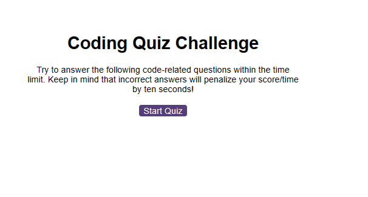

# code-Quiz

#Description
This project is a website that allows users to take a timed quiz on JavaScript fundamentals that stores high scores so that they can gauge their progress. The quiz is timed and will end if the user runs out of time. The user will be able to save their initials and score at the end of the quiz. The user will also be able to view high scores at any time by clicking the "View HighScores" button and clear the high scores by clicking the "Clear HighScores" button on the high scores page

This app runs in the browser, and features dynamically updated HTML and CSS powered by JavaScript. As always, built with accessibility in mind. Tested in Chrome, Firefox and Opera.

Instructions 📝
To take the Code Quiz:

Open the Code Quiz in your web browser.

Click the "Start Quiz" button to begin the quiz.

A question will appear with multiple-choice options.

Select the correct answer by clicking on the corresponding button.

If your answer is correct, the next question will appear automatically. If your answer is incorrect, time will be subtracted from the clock. ❌

The quiz will end when you have answered all the questions or when the timer reaches 0. ⏰

At the end of the quiz, your score will be displayed, and you will have the option to save your initials and score to the high scores list.

Remember, the faster you answer correctly, the higher your score will be!

## Screenshot

